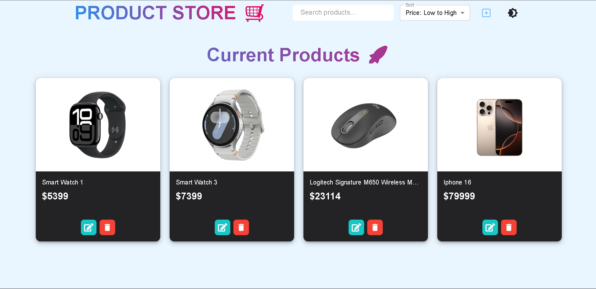
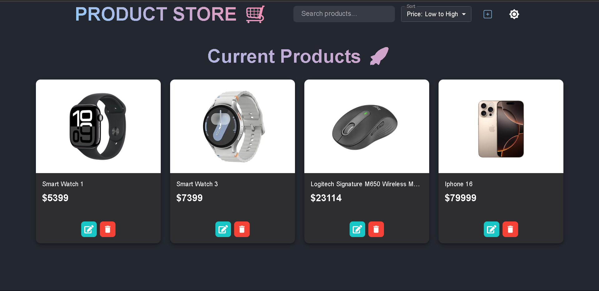
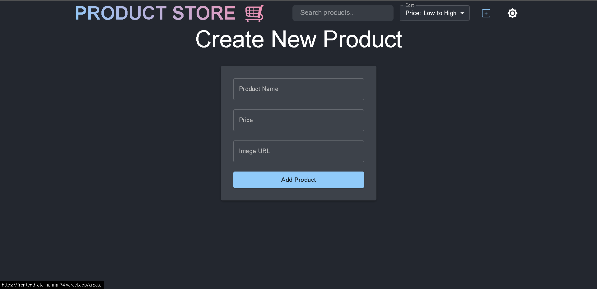

# 🛒 Product Store Frontend

A modern, responsive Product Store web application frontend built with **React**, **Material UI**, and **Zustand** for state management. This app allows users to add, edit, delete, and view products with a clean UI supporting both dark and light modes.

## ✨ Features

- 🔍 Search and sort products by name, price, or date
- 🌓 Light and dark mode toggle
- ➕ Add, edit, and delete products
- ⚡ Responsive UI with Material UI
- 🔗 Connects to a backend API for data persistence

## 🔗 Preview

[Live Demo](https://product-store-seven-phi.vercel.app/) <!-- Deployed app link here -->

## 📸 Screenshots

<!-- Screenshots below. Example: -->








## 🛠️ Tech Stack

- **Frontend:** React, Material UI, Zustand, React Router
- **Backend:** [See backend folder](./backend)
- **State Management:** Zustand

## 🚀 Getting Started

### Prerequisites

- [Node.js](https://nodejs.org/)
- Backend API running (see [./backend/README.md](./backend/README.md))

### Installation

```bash
cd frontend
npm install
```

### Running the App

```bash
npm run dev
```

The app will be available at [http://localhost:5173](http://localhost:5173) by default.

### Environment Variables

Create a `.env` file if you want to override the backend API URL:

```
VITE_API_BASE_URL=http://localhost:5000
```

## 📁 Project Structure

```
frontend/
  src/
    components/      # Reusable UI components (Navbar, ProductCard)
    pages/           # Page components (HomePage, CreatePage)
    store/           # Zustand store for products
    App.jsx          # Main app component
    main.jsx         # Entry point
    index.css        # Global styles
```

## 🧩 Main Files

- [`src/store/product.js`](src/store/product.js): Zustand store for product CRUD and fetching
- [`src/components/Navbar.jsx`](src/components/Navbar.jsx): Top navigation bar with search, sort, and theme toggle
- [`src/components/ProductCard.jsx`](src/components/ProductCard.jsx): Product display and edit/delete actions
- [`src/pages/HomePage.jsx`](src/pages/HomePage.jsx): Product listing page
- [`src/pages/CreatePage.jsx`](src/pages/CreatePage.jsx): Product creation form

## 🚀 Future Enhancements

- 🛒 Shopping cart functionality
- 📝 User authentication and profiles
- 📦 Pagination and filtering improvements
- 📱 Progressive Web App (PWA) support
- 🌐 Multi-language support
- 📊 Analytics dashboard for admins


## **🤝 Contributing**

- Pull requests are welcome. For major changes, please open an issue first to discuss what you'd like to change.


## **📃 License**
- This project is open-source and available under the MIT License.


## **🙋‍♂️ Author**

 Gaurav Singh Bhati

📧 [Gauravbhati2099](www.linkedin.com/in/gauravbhati2099) (Linkdn)

🎓 3rd Year CSE, Geetanjali Institute of Technical Studies
